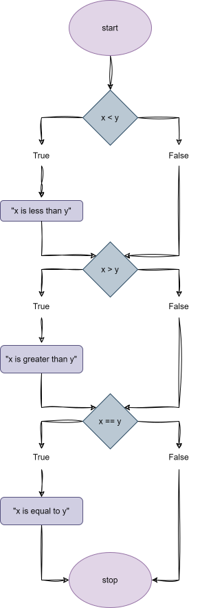
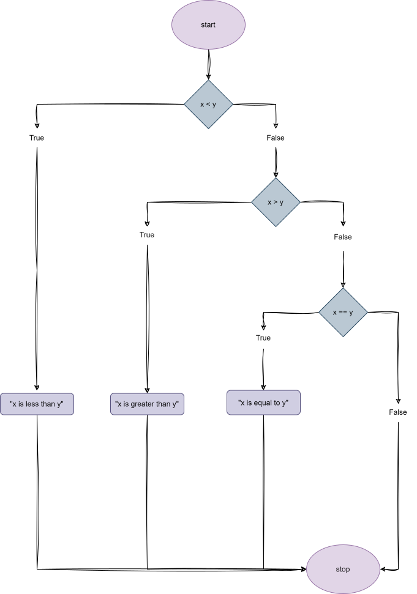
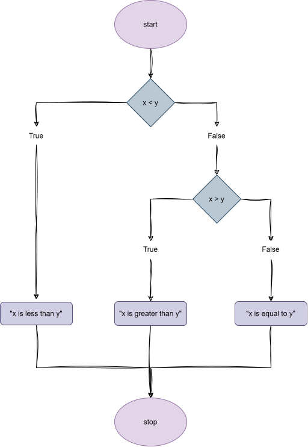
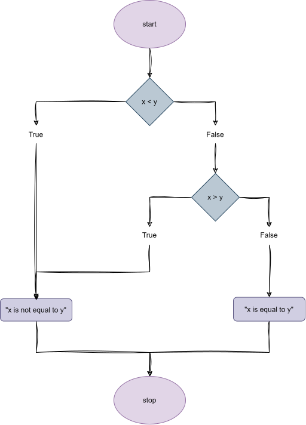
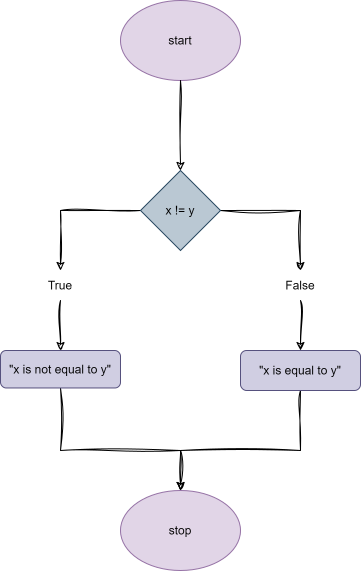
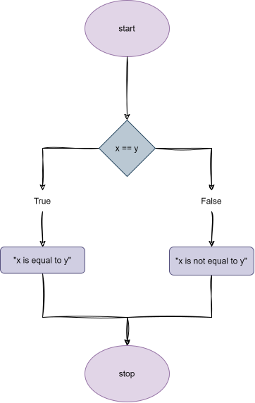

## Conditionals

- Ability to ask and answer questions

### Comparison Operators in Python

| Symbol | Meaning                  |
|--------|--------------------------|
| `>`    | Greater than             |
| `<`    | Less than                |
| `==`   | Equal to                 |
| `!=`   | Not equal to             |
| `>=`   | Greater than or equal to |
| `<=`   | Less than or equal to    |


## if

### Example of a code using if

```python
x = int(input("What's x? "))
y = int(input("What's y? "))

if x < y:
    print("x is less than y")
if x > y:
    print("x is greater than y")
if x == y:
    print("x is equal to y")
```

- In this example "x < y" is a boolean expression

#### Flowchart of the code

<p align="center">
    
</p>


## elif

### Example of a code using elif

```python
x = int(input("What's x? "))
y = int(input("What's y? "))

if x < y:
    print("x is less than y")
elif x > y:
    print("x is greater than y")
elif x == y:
    print("x is equal to y")
```

#### Flowchart of the code

<p align="center">
    
</p>


## else

### Example of a code using else

```python
x = int(input("What's x? "))
y = int(input("What's y? "))

if x < y:
    print("x is less than y")
elif x > y:
    print("x is greater than y")
else:
    print("x is equal to y")
```

#### Flowchart of the code 

<p align="center">
    
</p>
 

## or 

### Example of a code using or

```python
x = int(input("What's x? "))
y = int(input("What's y? "))

if x < y or x > y:
    print("x is not equal to y")
else:
    print("x is equal to y")
```

#### Flowchart of the code 

<p align="center">
    
</p>


## Not Equal

### Example of a code using not equal

```python
x = int(input("What's x? "))
y = int(input("What's y? "))

if x != y:
    print("x is not equal to y")
else:
    print("x is equal to y")
```

#### Flowchart of the code 

<p align="center">
    
</p>


### Example of a code using equal 

```python
x = int(input("What's x? "))
y = int(input("What's y? "))

if x == y:
    print("x is equal to y")
else:
    print("x is not equal to y")
```

#### Flowchart of the code

<p align="center">
    
</p>


## Identation, Colons 

- Identation is important in Python, if you don't use it, you will get an error

- The colon is also important, it tells Python that the next line is going to be a block of code


## and 

### Example of a code using and

```python
score = int(input("Score: "))

if score >= 90 and score <= 100:
    print("Grade: A")
elif score >= 80 and score < 90:
    print("Grade: B")
elif score >= 70 and score < 80:
    print("Grade: C")
elif score >= 60 and score < 70:
    print("Grade: D")
else:
    print("Grade: F")
```


## Chaining Comparison Operators

### Example of a code using chaining comparison operators

```python
score = int(input("Score: "))

if score >= 90:
    print("Grade: A")
elif score >= 80:
    print("Grade: B")
elif score >= 70:
    print("Grade: C")
elif score >= 60:
    print("Grade: D")
else:
    print("Grade: F")
```


## Bugs

### Example of a code with a bug: using if instead of elif

```python
score = int(input("Score: "))

if score >= 90:
    print("Grade: A")
if score >= 80:
    print("Grade: B")
if score >= 70:
    print("Grade: C")
if score >= 60:
    print("Grade: D")
```


## Modulo 

### Some remaining operators

| Symbol | Meaning             |
|--------|---------------------|
| `+`    | Addition            |
| `-`    | Subtraction         |
| `*`    | Multiplication      |
| `/`    | Division            |
| `%`    | Modulo (Remainder)  |

### Example of a code using modulo

```python
x = int(input("What's x? "))

if x % 2 == 0:
    print("x is Even")
else:
    print("x is Odd")
```

## Boolean 

### Example of a code using boolean

```python
def main():
    x = int(input("What's x? "))
    y = int(input("What's y? "))

    if is_even(x):
        print("x is Even")
    else:
        print("x is Odd")


def is_even(n):
    if n % 2 == 0:
        return True
    else:
        return False


main()
```

## Pythonic Expressions 

### Example of a code using Pythonic Expressions

```python
def main():
    x = int(input("What's x? "))
    y = int(input("What's y? "))

    if is_even(x):
        print("x is Even")
    else:
        print("x is Odd")


def is_even(n):
    return n % 2 == 0


main()
```


## match

### Example of a code using match

```python
name = input("What's your name? ")

match name:
    case "Harry" | "Herminone" | "Ron":
        print("Gryffindor")
    case  "Draco:":
        print("Slytherin")
    case _:
        print("Who?")

```
